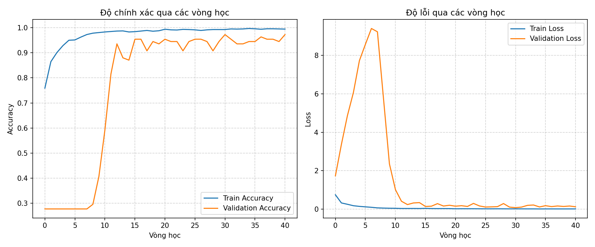

# 🧠 AI Training Model — Asthma Respiratory Audio TinyML

Thư mục `AI_Training_Model/` chứa toàn bộ pipeline AI của đề tài NCKH:

> **Nghiên cứu, thiết kế và chế tạo hệ thống IoT ứng dụng TinyML hỗ trợ theo dõi và cảnh báo sớm cho bệnh nhân hen suyễn.**

Pipeline đi từ:

```text
Dữ liệu WAV gốc
      ↓
Chia dữ liệu theo bệnh nhân
      ↓
Train-only augmentation
      ↓
Mel-Spectrogram
      ↓
DS-CNN Training
      ↓
INT8 Quantization
      ↓
Đối chiếu Python ↔ C++
      ↓
Kiểm thử qua microphone INMP441
      ↓
ESP32-S3 deployment
```

> ⚠️ Model trong project được xem là **bộ phân loại mẫu âm thanh hô hấp Asthma / Non-Asthma trong phạm vi dataset nghiên cứu**, không phải công cụ chẩn đoán y khoa độc lập.

---

# 📂 Cấu trúc thư mục

```text
AI_Training_Model/
│
├── Dataset/
│
├── Dataset_Chia/
│
├── P1_Chia_Du_Lieu/
│   ├── 1_Chia_Non_Asthma.py
│   ├── 2_Chia_va_Tang_Cuong_Asthma.py
│   └── Argument_Oversampling.py
│
├── P2_Preprocess_&_Traning_Model/
│   ├── Preprocess_Audio.py
│   ├── Training_Model.py
│   ├── Output_Preprocess/
│   └── Output_Train/
│
├── P3_Quantize_Model/
│
├── P4_Kiem_Tra_CPP/
│
├── P5_Kiem_Tra_Raw_Qua_Micro/
│
├── Quy_tac_chia_du_lieu.txt
│
└── README.md
```

Các stage chính:

```text
P1 = chia dữ liệu + augmentation
P2 = preprocessing + training + evaluation
P3 = quantization
P4 = đối chiếu Python/C++
P5 = kiểm thử raw audio qua microphone
```

---

# 1. P1 — Chia dữ liệu

## 1.1. Mục tiêu

Phiên bản hiện tại không còn:

```text
augment toàn bộ dataset
        ↓
random train_test_split
```

Thay vào đó:

```text
RAW DATA
   ↓
chia theo bệnh nhân trước
   ↓
train / val / test
   ↓
augmentation chỉ trên TRAIN
```

Mục tiêu là giảm nguy cơ:

```text
file gốc ở train
+
file augment họ hàng ở validation/test
```

làm metric đẹp giả tạo do data leakage.

---

# 2. `1_Chia_Non_Asthma.py`

Script xử lý dữ liệu `Non_Asthma`.

## Nguồn dữ liệu

Dữ liệu Non-Asthma gồm:

- Kaggle.
- Các nhóm bệnh:
  - Bronchial
  - COPD
  - Healthy
  - Pneumonia
- Dữ liệu môi trường tự thu.

## Cách chia

Các file Kaggle được gom theo:

```text
Disease + Patient ID
```

Ví dụ concept:

```text
COPD_P01
COPD_P02
Pneumonia_P05
...
```

Sau đó chia theo **group bệnh nhân**, không chia ngẫu nhiên từng WAV.

Tỷ lệ mục tiêu:

```text
~80% train
~10% validation
~10% test
```

và thực hiện riêng trong từng nhóm bệnh để các split vẫn có đại diện của nhiều nhóm bệnh.

---

## Deduplication

Script tính:

```text
SHA-256
```

cho các file gốc và loại các file có nội dung trùng hoàn toàn.

Thông tin duplicate được lưu để truy vết:

```text
file_trung.csv
```

Thông tin split được lưu:

```text
chia_du_lieu.csv
```

---

## Dữ liệu môi trường tự thu

Các file môi trường tự thu hiện được đưa **chỉ vào train**.

Lý do:

> metadata về phiên thu hiện tại chưa đủ chặt để bảo đảm các đoạn thuộc cùng một recording session có thể được tách độc lập sang train/val/test mà không tạo leakage.

Do đó:

```text
Environment self-recorded
        ↓
TRAIN ONLY
```

---

# 3. `2_Chia_va_Tang_Cuong_Asthma.py`

Script xử lý dữ liệu `Asthma`.

Nguồn hiện tại:

```text
288 file Asthma gốc
```

## 3.1. Chia theo bệnh nhân

Tên file được đọc Patient ID theo dạng:

```text
P<number>
```

Toàn bộ file thuộc cùng một bệnh nhân được giữ trong cùng một split.

Pipeline:

```text
Asthma RAW
   ↓
hash dedup
   ↓
group by Patient
   ↓
shuffle với SEED=42
   ↓
train / val / test
```

Tỷ lệ chia dựa trên **số bệnh nhân**:

```text
~80% train
~10% validation
~10% test
```

Validation và test chỉ chứa **file gốc**.

---

# 4. Train-only Asthma Augmentation

Sau khi split xong mới augmentation.

```text
Asthma TRAIN originals
        ↓
augmentation
        ↓
Asthma TRAIN expanded
```

Không augmentation:

```text
Validation
Test
```

Số Asthma train được sinh động để gần bằng số Non-Asthma train thực tế, thay vì hard-code một con số cố định.

---

## 4.1. Các phép augmentation

Các hàm nằm trong:

```text
Argument_Oversampling.py
```

và chỉ được gọi cho Asthma train.

### 1. Mix Environmental Noise

```text
audio + environmental_noise × gain
```

Gain ngẫu nhiên:

```text
0.02 → 0.10
```

---

### 2. Time Shift on Silence

Script:

1. Tính RMS theo frame.
2. Tìm vùng năng lượng cao.
3. Lấy khoảng lõi khoảng 4 giây.
4. Chèn lõi này vào một vị trí ngẫu nhiên trong background silence 5 giây.

Mục tiêu:

> thay đổi vị trí respiratory pattern theo thời gian mà vẫn giữ phần tín hiệu quan trọng.

---

### 3. White Noise

```text
audio + noise_level × Gaussian noise
```

Giá trị hiện tại:

```text
noise_level = 0.001
```

---

### 4. Time Stretch

Rate ngẫu nhiên:

```text
0.8 → 1.2
```

Sau biến đổi, audio được fix lại về:

```text
5 s
16 kHz
```

---

### 5. Pitch Shift

Pitch shift ngẫu nhiên:

```text
-0.5 → +0.5 semitone
```

Sau đó cũng fix lại độ dài 5 giây.

---

## 4.2. Khả năng truy vết augmentation

Mỗi file augmentation lưu:

- file mới;
- file cha;
- Patient ID;
- phương pháp;
- seed;
- tham số biến đổi.

Output:

```text
tang_cuong.csv
```

Điều này giúp truy lại nguồn của từng sample train.

---

# 5. Dataset sau khi chia

Training log hiện tại cho thấy dữ liệu sau preprocessing có:

| Split | Tổng | Asthma | Non-Asthma |
|---|---:|---:|---:|
| Train | **1666** | **833** | **833** |
| Validation | **108** | 30 | 78 |
| Test | **113** | 30 | 83 |

Train được cân bằng:

```text
Asthma     = 833
Non_Asthma = 833
```

Validation/Test không bị ép cân bằng bằng augmentation.

Đây là chủ ý.

---

# 6. P2 — `Preprocess_Audio.py`

Script không chia lại dữ liệu.

Nó đọc trực tiếp:

```text
Dataset_Chia/
├── Asthma/
│   ├── train/
│   ├── val/
│   └── test/
│
└── Non_Asthma/
    ├── train/
    ├── val/
    └── test/
```

và tạo Mel-Spectrogram cho từng split riêng biệt.

---

# 7. DSP Pipeline

## Thông số

| Tham số | Giá trị |
|---|---:|
| Sample Rate | 16000 Hz |
| Duration | 5 s |
| Samples | 80000 |
| Low Cut | 100 Hz |
| High Cut | 2000 Hz |
| Butterworth Order | 5 |
| Pre-emphasis | 0.97 |
| N_FFT | 1024 |
| Hop Length | 625 |
| N_Mels | 64 |
| Window | Hann |
| Mel | Slaney |
| `top_db` | 80 |

---

## Pipeline chính xác

```text
WAV
 |
 v
librosa.load
16 kHz / mono
 |
 v
fix_length
80000 samples
 |
 v
Peak Normalization
L∞
 |
 v
Butterworth Bandpass
100–2000 Hz
 |
 v
Pre-emphasis
0.97
 |
 v
STFT
Hann Window
 |
 v
Mel Filterbank
64 bands
Slaney
 |
 v
Power → dB
top_db = 80
 |
 v
Mel 64 × 129
```

Các tham số quan trọng được ghi tường minh trong code:

```text
center=True
htk=False
window="hann"
pad_mode="constant"
power=2.0
norm="slaney"
```

nhằm tránh việc nâng phiên bản `librosa/scipy` làm thay đổi pipeline một cách âm thầm.

---

# 8. Output Preprocessing

Mỗi split lưu riêng:

```text
Output_Preprocess/
│
├── X_train_mel.npy
├── Y_train_mel.npy
├── Files_train.npy
│
├── X_val_mel.npy
├── Y_val_mel.npy
├── Files_val.npy
│
├── X_test_mel.npy
├── Y_test_mel.npy
└── Files_test.npy
```

Shape mỗi sample:

```text
64 × 129 × 1
```

Nhãn:

```text
0 = Asthma
1 = Non_Asthma
```

Script kiểm tra:

- X/Y/file count phải khớp.
- Không NaN.
- Không Inf.
- Mel phải đúng shape `(64,129)`.

---

# 9. P2 — `Training_Model.py`

Training script nhận thẳng ba tập:

```text
train
validation
test
```

đã tạo từ bước preprocessing.

Không thực hiện:

```python
train_test_split(...)
```

trên dataset đã augmentation.

---

# 10. Train-only Min-Max Normalization

Chỉ lấy min/max từ train:

```python
train_min = np.min(x_train)
train_max = np.max(x_train)
```

Kết quả hiện tại:

```text
TRAIN_MIN = -80.0
TRAIN_MAX = 0.0
```

Công thức:

```text
X_norm = (X - TRAIN_MIN)
         -----------------------
         (TRAIN_MAX - TRAIN_MIN)
```

Hai hằng số từ train được áp dụng lại cho:

```text
Train
Validation
Test
```

Không tính min/max mới cho validation/test.

---

# 11. DS-CNN Architecture

Input:

```text
64 × 129 × 1
```

Mạng hiện tại:

```text
Input
 |
 v
SeparableConv2D(16, 3×3)
BatchNormalization
MaxPool2D
 |
 v
SeparableConv2D(32, 3×3)
BatchNormalization
MaxPool2D
 |
 v
SeparableConv2D(64, 3×3)
BatchNormalization
MaxPool2D
 |
 v
Flatten
8192
 |
 v
Dense(64, ReLU)
 |
 v
Dropout(0.3)
 |
 v
Dense(1, Sigmoid)
```

Model summary:

```text
Total params       = 527,994
Trainable params   = 527,770
Non-trainable      = 224
```

Phần lớn parameter hiện nằm ở:

```text
Flatten(8192)
      ↓
Dense(64)
```

với:

```text
524,352 parameters
```

---

# 12. Training Configuration

```text
SEED       = 42
EPOCHS     = 100
BATCH_SIZE = 32

Optimizer  = Adam
Loss       = Binary Crossentropy
Metric     = Accuracy
```

Train hiện cân bằng 1:1 nên class weight thực tế:

```text
Asthma     = 1.0
Non_Asthma = 1.0
```

---

# 13. Callbacks

## EarlyStopping

```text
monitor = val_loss
patience = 10
restore_best_weights = True
```

## ReduceLROnPlateau

```text
monitor = val_loss
factor = 0.5
patience = 5
min_lr = 1e-6
```

## ModelCheckpoint

Model tốt nhất theo:

```text
minimum val_loss
```

được lưu:

```text
Bin_Asthma.keras
```

Ngoài ra:

- CSVLogger.
- TensorBoard.
- TerminateOnNaN.

---

# 14. Training History

File:

```text
P2_Preprocess_&_Traning_Model/
└── Output_Train/
    └── Training_History.png
```



## Nhận xét

### Train Accuracy

Tăng từ khoảng:

```text
0.76
```

lên gần:

```text
0.99
```

### Validation Accuracy

Giai đoạn đầu rất thấp, sau đó tăng mạnh và về cuối chủ yếu dao động quanh:

```text
~0.90 → 0.97
```

### Train Loss

Giảm rất nhanh và tiến gần 0.

### Validation Loss

Giai đoạn đầu tăng rất mạnh, sau đó giảm sâu và ổn định hơn.

Điều này cho thấy model học rất mạnh trên train nhưng vẫn có **generalization gap** giữa train và validation.

Vì vậy không dùng:

```text
Train Accuracy ≈ 99%
```

hay:

```text
Peak Validation Accuracy
```

làm kết quả chính thức.

Kết quả cuối phải lấy từ **test độc lập**.

---

# 15. Test Evaluation

Sau training, script load lại:

```text
Bin_Asthma.keras
```

là model có `val_loss` tốt nhất rồi mới chấm trên test.

## Kết quả chính thức hiện tại

```text
Test Loss     = 0.825651
Test Accuracy = 0.867257
              = 86.73%
```

---

# 16. Confusion Matrix

Theo thứ tự:

```text
[Asthma, Non_Asthma]
```

kết quả:

```text
[[27,  3],
 [12, 71]]
```

Diễn giải:

| Ground Truth | Predict Asthma | Predict Non-Asthma |
|---|---:|---:|
| Asthma | **27** | 3 |
| Non-Asthma | 12 | **71** |

Do đó:

```text
Asthma:
27 đúng
3 bỏ sót

Non-Asthma:
71 đúng
12 false-positive thành Asthma
```

---

# 17. Classification Report

| Class | Precision | Recall | F1-score | Support |
|---|---:|---:|---:|---:|
| Asthma | 0.6923 | **0.9000** | 0.7826 | 30 |
| Non-Asthma | **0.9595** | 0.8554 | **0.9045** | 83 |
| **Accuracy** | | | **0.8673** | 113 |
| Macro Avg | 0.8259 | 0.8777 | 0.8435 | 113 |
| Weighted Avg | 0.8885 | 0.8673 | 0.8721 | 113 |

Điểm đáng chú ý:

```text
Asthma Recall = 90.00%
```

nhưng:

```text
Asthma Precision = 69.23%
```

Tức model bắt được phần lớn Asthma test nhưng vẫn có số lượng false-positive đáng kể.

Không được gọi:

```text
Recall 90%
```

là:

```text
Accuracy 90%
```

vì hai metric khác nhau.

---

# 18. Vì sao model mới chỉ ~86.73%?

Các phiên bản cũ từng có metric cao hơn.

Tuy nhiên pipeline mới thay đổi methodology theo hướng chặt hơn:

```text
Patient-wise split
      ↓
Split BEFORE augmentation
      ↓
Train-only augmentation
      ↓
Validation/Test originals
      ↓
Train-only normalization statistics
      ↓
Validation selects model
      ↓
Test used only at the end
```

Do đó accuracy giảm không nhất thiết là model “tệ hơn”.

Nó có thể phản ánh:

> phép đánh giá hiện tại khó hơn và ít nguy cơ leakage hơn.

Trong NCKH, kết quả:

```text
86.73%
```

được ưu tiên hơn một metric cao nhưng có methodology không chặt.

---

# 19. Output Training

```text
Output_Train/
│
├── Bin_Asthma.keras
├── Normalization_Params.txt
├── Test_Report.txt
├── Training_History.png
├── training_log.csv
└── logs/
```

## `Normalization_Params.txt`

Hiện tại:

```text
TRAIN_MIN=-80.0
TRAIN_MAX=0.0
```

## `Test_Report.txt`

Hiện tại lưu:

- Test Loss.
- Test Accuracy.
- Confusion Matrix.
- Precision.
- Recall.
- F1-score.
- Support.

---

# 20. P3 — Quantize Model

Sau khi model Float32 được chốt:

```text
Bin_Asthma.keras
      ↓
P3_Quantize_Model
      ↓
INT8 TFLite
      ↓
C/C++ model data
```

Nguyên tắc bắt buộc:

- Representative dataset chỉ lấy từ **train**.
- Representative dataset phải có đại diện của cả hai lớp.
- Không dùng validation/test để calibration INT8.
- Full INT8 phải được kiểm tra trước khi đưa lên firmware.
- `scale/zero_point` phải lấy từ artifact/tensor tương ứng với model hiện tại, không giả định cố định giữa các lần train.

Chi tiết implementation nằm trong `P3_Quantize_Model/`.

---

# 21. P4 — Kiểm tra C++

Mục tiêu của:

```text
P4_Kiem_Tra_CPP/
```

là đối chiếu pipeline Python với implementation C++ trước khi đưa toàn bộ pipeline vào deployment thực.

Các hạng mục kiểm tra của project hướng tới:

```text
PCM16
↓
DSP
↓
Mel
↓
Normalization / Quantization
↓
Inference
```

Mục tiêu là:

> **functional / classification equivalence**

không yêu cầu mọi giá trị floating-point Python và C++ phải bit-exact.

---

# 22. P5 — Kiểm tra Raw qua Microphone

`P5_Kiem_Tra_Raw_Qua_Micro/` là stage gần deployment thực tế hơn:

```text
Raw WAV
   ↓
Speaker playback
   ↓
Air
   ↓
INMP441
   ↓
ESP32-S3
   ↓
DSP
   ↓
TinyML
```

Stage này kiểm tra ảnh hưởng thực tế của:

- microphone;
- playback/acoustic path;
- amplitude;
- environmental noise;
- VAD;
- deployment DSP.

Đây là bước khác hoàn toàn với test tensor/static inference.

---

# 23. Current AI v1.0 Record

```text
Model                : DS-CNN Binary Classifier
Classes              : Asthma / Non-Asthma

Sample Rate          : 16 kHz
Input Duration       : 5 s
Input Samples        : 80,000

Bandpass             : 100–2000 Hz
Filter Order         : 5
Pre-emphasis         : 0.97

N_FFT                : 1024
Hop Length           : 625
N_Mels               : 64
Window               : Hann
Mel                  : Slaney
Input Shape          : 64 × 129 × 1

Normalization Min    : -80.0
Normalization Max    : 0.0

Train                : 1666 samples
Validation           : 108 samples
Test                 : 113 samples

Test Loss            : 0.825651
Test Accuracy        : 86.73%

Asthma Precision     : 69.23%
Asthma Recall        : 90.00%
Asthma F1            : 78.26%

Model Params         : 527,994

Deployment Target    : ESP32-S3
Deployment Runtime   : TensorFlow Lite Micro
```

---

# 24. Model Freeze

Phiên bản hiện tại được xem là:

```text
AI MODEL v1.0
```

Tạm freeze để tiếp tục xây dựng hệ thống IoT final.

Không retrain chỉ với mục tiêu:

```text
"làm accuracy đẹp hơn"
```

nếu không có:

- dataset mới có cơ sở;
- phát hiện lỗi methodology;
- bug preprocessing;
- lỗi quantization;
- domain gap cần giải quyết;
- yêu cầu nghiên cứu mới.

---

# 25. Quy trình chạy lại từ đầu

Thứ tự concept:

```text
1. Chuẩn bị Dataset/
        ↓
2. P1_Chia_Du_Lieu/
        ↓
   1_Chia_Non_Asthma.py
        ↓
   2_Chia_va_Tang_Cuong_Asthma.py
        ↓
3. Preprocess_Audio.py
        ↓
4. Training_Model.py
        ↓
5. Đọc Test_Report.txt
        ↓
6. P3_Quantize_Model
        ↓
7. P4_Kiem_Tra_CPP
        ↓
8. P5_Kiem_Tra_Raw_Qua_Micro
        ↓
9. Deploy_Model/
```

> `Argument_Oversampling.py` là module chứa các hàm augmentation và được `2_Chia_va_Tang_Cuong_Asthma.py` sử dụng; không phải stage độc lập cần chạy trực tiếp.

---

# 26. Checklist trước khi thay model trên ESP32-S3

- [ ] Dataset được chia theo patient trước augmentation.
- [ ] Không có augmentation trong validation/test.
- [ ] Kiểm tra duplicate.
- [ ] Preprocessing đúng `16 kHz / 5 s`.
- [ ] Bandpass đúng `100–2000 Hz`.
- [ ] Hann window.
- [ ] Mel Slaney.
- [ ] Shape đúng `64×129×1`.
- [ ] `TRAIN_MIN=-80`.
- [ ] `TRAIN_MAX=0`.
- [ ] Đọc Test Report.
- [ ] Kiểm tra Confusion Matrix.
- [ ] Kiểm tra Asthma Precision/Recall/F1.
- [ ] Quantize chỉ bằng representative train data.
- [ ] Test INT8 model.
- [ ] Đối chiếu Python ↔ C++.
- [ ] Test qua INMP441.
- [ ] Chỉ sau đó mới thay model trong final firmware.

---

# 27. Nguyên tắc của pipeline hiện tại

1. **Split before augmentation.**
2. **Patient-wise split.**
3. **Train-only augmentation.**
4. **Validation để chọn model.**
5. **Test chỉ dùng ở cuối.**
6. **Normalization statistics chỉ lấy từ train.**
7. **INT8 representative data chỉ lấy từ train.**
8. **Giữ khả năng truy vết file và augmentation.**
9. **Python/C++ phải cùng specification DSP.**
10. **Ưu tiên methodology đúng hơn metric đẹp.**

---

# 📌 Trạng thái

```text
P1 — Dataset Split / Augmentation     ✅
P2 — Preprocess / DS-CNN Training     ✅
P3 — Quantization                     ✅ / theo artifact hiện tại
P4 — Python ↔ C++ Verification        ✅ / tiếp tục giữ để regression test
P5 — Raw Audio ↔ INMP441 Test         ✅ / deployment validation

AI v1.0                              FROZEN
```

Pipeline AI hiện được giữ ổn định để chuyển trọng tâm sang:

```text
Final_Project_NCKH/
├── Patient_Node/
├── Gateway/
└── Dashboard/
```
